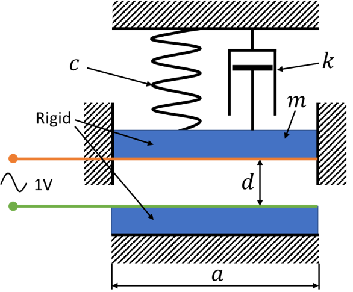
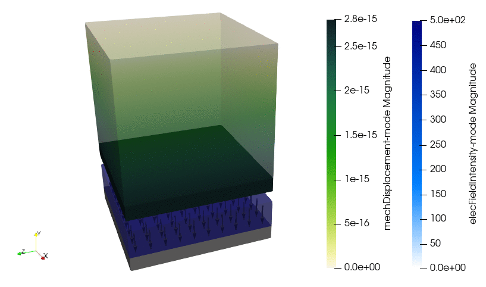

# 3D Harmonic Analysis of a Plate Capacitor

## Model Setup

This test case consists of two conducting plates. Between the plates, there is an air gap. The lower plate is fixed and the upper plate is attached to a spring (i.e. material with poisson number 0). A harmonic voltage is applied across the plates and the electrostatic forces moves the upper plate towards the lower plate. The aim of this Testcases is to test the calculation of electrostatic forces in a 3D model with complex numbers.

<div align="center">

</div>

## Analytical Solution (for 1000Hz)

Excitation through electrostatic Force:
```math
F_E=F_0\cdot cos(\omega t)\\
F_0=\frac{\epsilon U^2 a^2}{2d^2}=\frac{8.85\cdot10^{-12}\text{F}/\text{m} (1\text{V})^2 (0.01\text{m})^2}{2(0.002\text{m})^2}=1.106\cdot10^{-10}\text{N}
```
Mechanic diplacement amplitude:
```math
A_0=F_0/c=1.106\cdot10^{-14}\text{m}\\
\omega_0=\sqrt{\frac{c}{m}}=3.162\cdot10^3\text{s}^{-1}\\
D=\frac{k}{2\sqrt{cm}}=0.474\\
\eta=\frac{\omega}{\omega_0}\\
\\
A=\frac{A_0}{\sqrt{(1-\eta^2)^2+(2D\eta)^2}}=3.162\cdot10^{-15}\text{m}
```

## Numerical Solution
For 1000Hz:
```math
A=3.161\cdot10^{-15}\text{m}
```

.

For frequency range 1-2000Hz (amplitude response):

").
