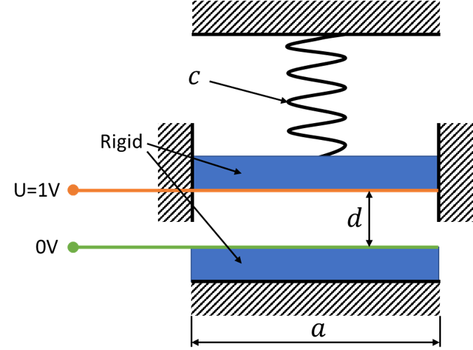
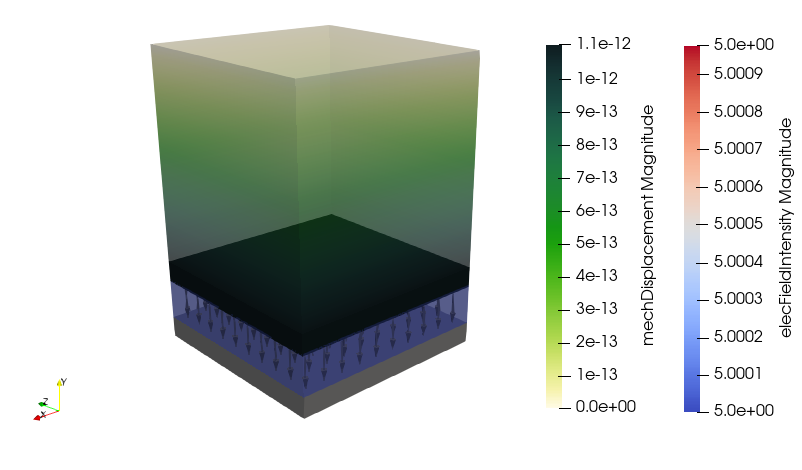

# 3D Static Analysis of a Plate Capacitor

## Model Setup
This test case consists of two conducting plates. Between the plates, there is an air gap. The lower plate is fixed and the upper plate is attached to a spring (i.e. material with poisson number 0). A voltage is applied across the plates and the electrostatic forces moves the upper plate towards the lower plate. The aim of this Testcases is to test electrostatic forces in a 3D model.

<div align="center">

</div>

## Analytical Solution

Electrostatic force on a plate capacitor:
```math
F_E=\frac{\epsilon U^2 a^2}{2d^2}=\frac{8.85\cdot10^{-12}\text{F}/\text{m} (1\text{V})^2 (1\text{m})^2}{2(0.2\text{m})^2}=1.106\cdot10^{-10}\text{N}
```
Mechanic Diplacement:
```math
\Delta l=\frac{F_E}{c}=\frac{1.106\cdot10^{-10}\text{N}}{100\text{N}/\text{m}}=1.106\cdot10^{-12}\text{m}
```

## Numerical Solution

```math
\Delta l=-1.10624916986\cdot10^{-12}\text{m}
```


