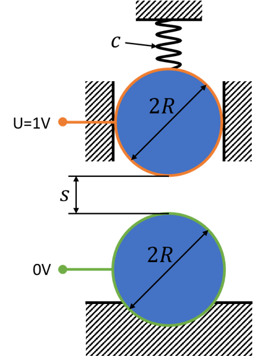
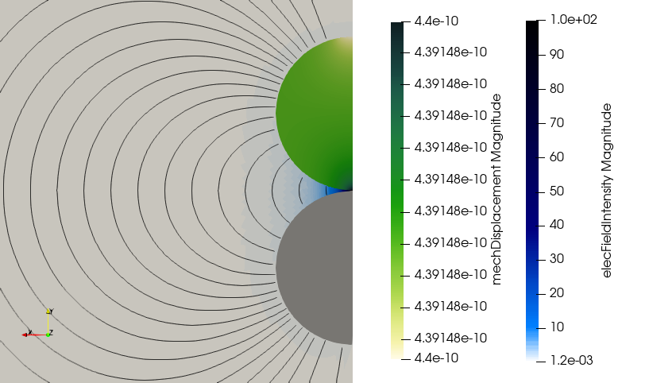

# Electrostatic Force between two Conducting Spheres

## Model Setup
This test case consists of two conducting spheres. Between the spheres, there is an air gap. The lower sphere is fixed and the upper sphere is attached to a spring and damper (i.e. material with poisson number 0 and rayleigh damping). A harmonic voltage is applied across the spheres and the electrostatic forces moves the upper sphere towards the lower sphere. The aim of this Testcases is to test the calculation of electrostatic forces in a complex geometry (with non-planar surfaces and inconsistent surface force densities).

<div align="center">

</div>

## Analytical Solution

Electrostatic force between two conducting spheres with constant potential:
```math
F_E=\frac{-\pi U^2 R \epsilon}{2s}=\frac{-\pi\cdot(1\text{V})^2\cdot1\text{m}\cdot8.85\cdot10^{-12}\text{F}/\text{m}}{2\cdot0.01\text{m}}=-1.390\cdot10^{-9}\text{N}
```
Mechanic Diplacement:
```math
\Delta l=\frac{F_E}{c}=\frac{-1.390\cdot10^{-9}\text{N}}{3.142\text{N}/\text{m}}=4.425\cdot10^{-10}\text{m}
```

## Numerical Solution

```math
\Delta l=-4.3915\cdot10^{-10}\text{m}
```


