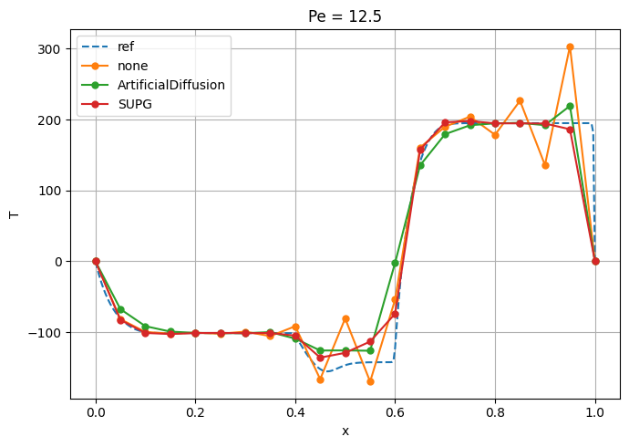

## SUPG 3d

This example is based on a simple 3d mesh and utilizes all the boundary conditions that enable SUPG stabilization.
The results are compared to a finer resolved mesh (in this case 15 times finer).
To reproduce this, just decrease the element size in the .jou file by a factor of 15.

