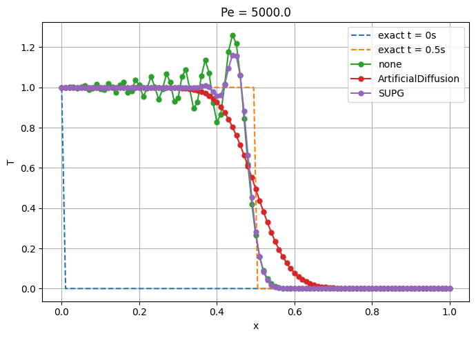

## SUPG_transient

This testcase implements the COMSOL example found [here](https://www.comsol.com/blogs/understanding-stabilization-methods).

A step in temperature at t=0 and x=0 is modeled in a material with low conductivity, high velocity and large elements.
This causes instabilities as seen in the solution without stabilization (none).
ArtificialDiffusion introduces additional damping.
SUPG shows a good balance between local oscillations and reproducing the step.

