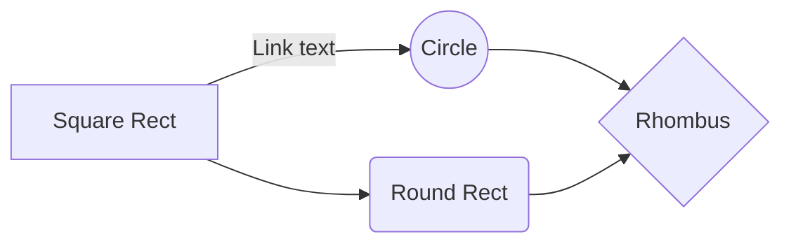

Developer Docu
==============

General information
-------------------

This is the CFS++ developer docu created as a set of markdown files. Thereby, we have the following rules:

* The main file is `README.md` located in the `source` directory
* All general files are located in `/share/doc/developer/pages` 
* All files directly describing a class are located in the corresponding directory and named `README.md`; see, e.g., `/source/PDE/README.md`

For info about the markdown syntax see 

* Quickstart for [markdown syntax](/share/doc/developer/doxygen/pages/markdownSyntax.md)
* [gitlab-markdown](https://docs.gitlab.com/ee/user/markdown.html).
* markdown editor [atom](https://atom.io/); install for Latex and mermaid preview support: apm install markdown-preview-enhanced

One can even do diagrams using [mermaid](https://mermaidjs.github.io/) which are rendered as graphs

Go to the [developer documentation](../../../source/README.md)
-----------------------------------