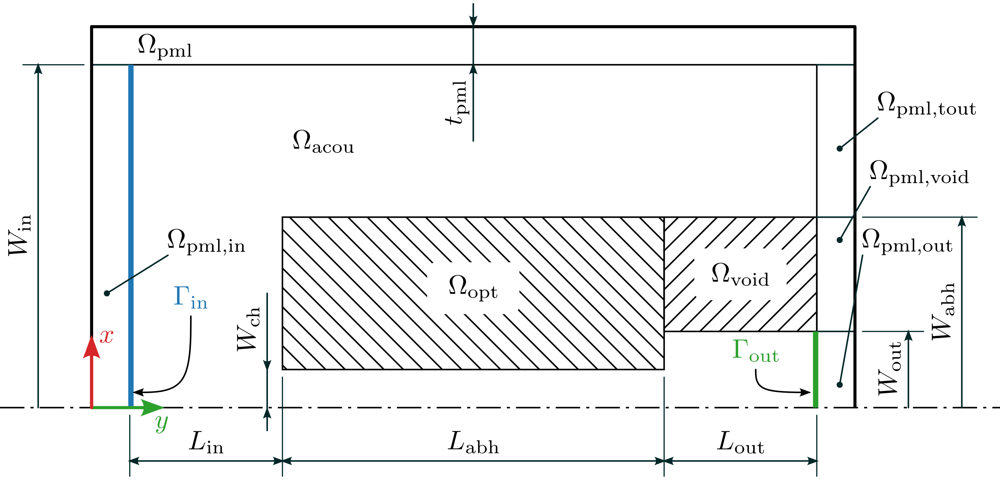

# Tools for Acoustic Topology Optimization

Tools to perform acoustic topology optimization, additionally to the cfs tools located in `cfs/share/python`.
The tools are documented in their usage/help messages.

## create_mesh_acou.py

Additionally to the usage message, refer to the sketch below:

This sketch is not complete in defined regions and surfaceRegions,
please run `cfs -g` and examine all defined regions in ParaView.
