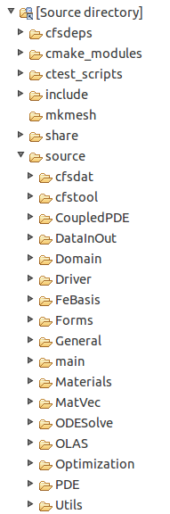

Many of the classes in CFS++ are grouped into modules. These modules define the building blocks of any finite element program: 

* Computational Domain ([CoefFunction](./Domain/CoefFunction/README.md), ElemMapping, Mesh, Results, ...) 
* [PDEs](./PDE/README.md) (StdPDE, SinglePDE, AcousticPDE, AcousticPDE_BEM, ElecPDE, MechPDE, ...)
* CoupledPDEs (DirectCoupledPDEs, IterCoupledPDEs, ...)
* [Driver](/source/Driver/README.md) (MultiSequence, Static, Transient, Harmonic, EigenFrequency, ...)
* [FeBasis](/source/FeBasis/README.md) (FeSpace for H1, Hcurl, Hdiv, L2; FeFunction, ...)
* DataInOut (SimInput, SimOutput, SimState, ParamHandling, ...)
* Forms ([BiLinForms](./Forms/BiLinForms/README.md), [LinForms](./Forms/LinForms/README.md), Operators, ...)
* Materials (AcousticMaterial, MechaniMaterial, MagneticMaterial, ...)
* Algebraic Solver OLAS (AlgSys, Solver, PreCond, Graph, ...)
* Optimization (Condition, Ersazmaterial, LevelSet, ...)
* Utils (Approxdata, AutoDiff, ...)

>

The directory structure of the source looks as follows (e.g., **eclipse project**)

First steps to understand the structure of CFS++
---------------------------------------------------

* [A tour through CFS++](../share/doc/developer/pages/TourCFS.md). We perform a simple static mechanical computation and explain, which objects are created at which instant of time during the computation!
* How to implement a new PDE?
* [How to implement a new post-processing result?](../share/doc/developer/pages/PostProcessing.md)
